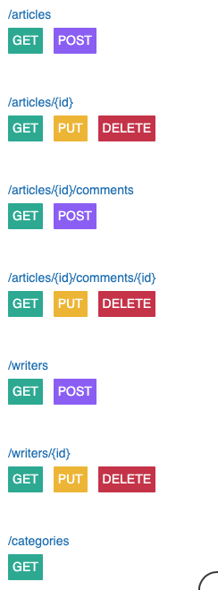
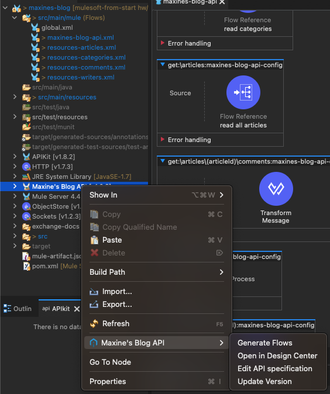
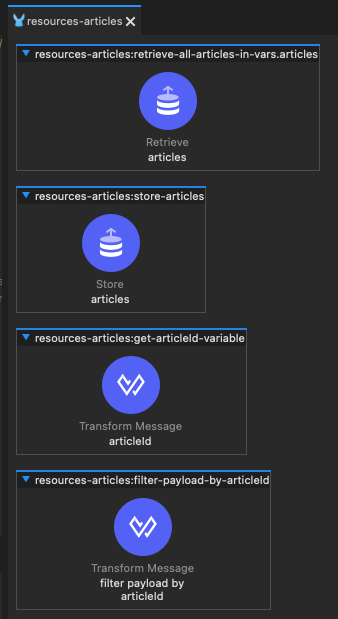
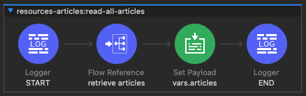
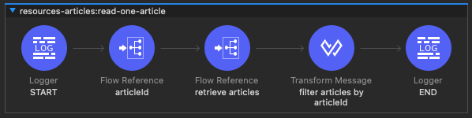
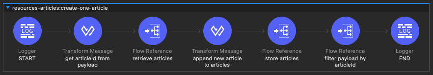
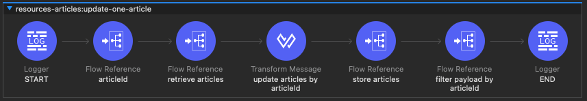
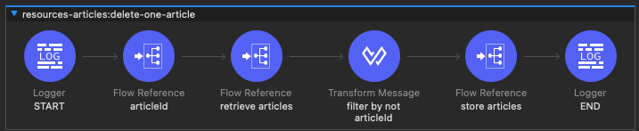

# MuleSoft from Start: A Beginner's Guide

Everything discussed in the Twitch live sessions for MuleSoft beginners.

- Follow me on Twitch to see the live streams: [DevAlexMartinez](https://www.twitch.tv/devalexmartinez)
- Or watch the recorded and edited (shorter) versions in [ProstDev's YouTube channel](https://www.youtube.com/prostdev)

---

## 🗓️ Next session

The next session is scheduled for `July 19, 2023` at `1:30pm ET`.

What we'll do:
- Homework review
- Continue with the implementation for the rest of the resources
  - Making sure the IDs are unique
  - Handle errors (not just happy path)
  - Create writers, categories, etc. from POST/articles when needed
- Postman collections
- Debugging
- Fixing errors

---

## 💻 Past Sessions

| Session | Title | Description | Twitch | YouTube
| - | - | - | - | - |
| 0 | Planning the Outline | Based on the book `MuleSoft for Salesforce Developers`, we reviewed the relevant topics and created an appropriate outline for the upcoming sessions. More info [here](https://medium.com/another-integration-blog/mulesoft-from-start-a-beginners-guide-session-0-e6e98ba4200a). | [Full video (55min)](https://www.twitch.tv/videos/1816506733) | [Edited video (38min)](https://youtu.be/xzi8peU87v0)
| 1 | MuleSoft Overview | We went through an overview of the different MuleSoft products and how to get involved with the community. More info [here](https://medium.com/another-integration-blog/mulesoft-from-start-a-beginners-guide-session-1-mulesoft-overview-62fa9307ea2f). | [Full video (1h2min)](https://www.twitch.tv/videos/1822381945) | [Edited video (34min)](https://youtu.be/I6BWPoD639A)
| 2 | What is an API? | We explained the API basics and learned what is MuleSoft's API-led connectivity approach. More info [here](https://medium.com/another-integration-blog/mulesoft-from-start-a-beginners-guide-session-2-what-is-an-api-9a4602bbc51a). | [Full video (1h1m)](https://www.twitch.tv/videos/1840283988) | [Edited video (35min)](https://youtu.be/M4gYW2o9IKc)
| 3 | Design an API Specification | We created the requirements for our Blog API and started designing our API Spec. Finish your homework before the next session! More info [here](https://medium.com/another-integration-blog/mulesoft-from-start-a-beginners-guide-session-3-design-an-api-specification-2a315899f22f). | [Full video (1h16m)](https://www.twitch.tv/videos/1846281214) | [Edited video (42min)](https://youtu.be/XIrCqwmTPQs)
| 4 | Test & Publish the API Spec | We tested the API Specification using the mocking service in Design Center and adjusted a few things we had to change. Then, we published the API Spec to Exchange. Finally, we created a new Mule project from the published asset. More info [here](https://medium.com/another-integration-blog/mulesoft-from-start-a-beginners-guide-session-4-test-publish-the-api-specification-7dcca81e0b07). | [Full video (1h10m)](https://www.twitch.tv/videos/1858212063) | [Edited video (27min)](https://youtu.be/ho5GQJD8Hxo)
| 5 | Develop the API in Anypoint Studio | We created a new Mule project with the scaffolded flows from the published API specification and started our API implementation / development. More info [here](https://medium.com/another-integration-blog/mulesoft-from-start-a-beginners-guide-session-5-develop-the-api-in-anypoint-studio-a7dcfc43655c). | [Full video (1h19m)](https://www.twitch.tv/videos/1864154096) | [Edited video (37m)](https://youtu.be/K9ntwKz9vds)

---

## 📝 Outline & Links 🔗

### ✅ Session 1

<details>
<summary>MuleSoft Overview</summary>

- MuleSoft products
    - [Anypoint Platform](https://anypoint.mulesoft.com/) - You can create as many free trial accounts as you want! Just change the username in each account.
    - [Anypoint Studio](https://www.mulesoft.com/platform/studio) - Main IDE
    - [DataWeave](https://dataweave.mulesoft.com/)
        - [Extension for VSCode](https://marketplace.visualstudio.com/items?itemName=MuleSoftInc.dataweave)
        - [Playground](https://dataweave.mulesoft.com/learn/playground)
        - [DataWeave CLI](https://github.com/mulesoft-labs/data-weave-cli)
    - [Anypoint Code Builder (BETA)](https://www.mulesoft.com/platform/api/anypoint-code-builder) - STILL IN BETA!!! DO NOT USE YET!
    - [Composer](https://www.mulesoft.com/platform/composer)
    - [MuleSoft RPA](https://www.mulesoft.com/platform/rpa)
- [Community overview](https://www.mulesoft.com/community)
    - [Ambassadors](https://developer.mulesoft.com/community/ambassadors) & [Mentors](https://developer.mulesoft.com/community/mentors)
    - [Meetups](https://meetups.mulesoft.com/)
    - [Help forums](https://help.mulesoft.com/s/)
- [Trainings/certification](https://training.mulesoft.com/overview)

**Other resources**

- Sravan Lingam's [MuleSoft Training for Absolute Beginners](https://www.youtube.com/playlist?list=PL61bQcdxsK6_1tb0BbAtAOX_SdtvgQlxV)
- Jitendra Bafna's [Mule Technology Academy - Zero To Hero](https://www.youtube.com/@muletechnologyacademy-zero5625)
- [Whitney Akinola's blog](https://www.whitneyakinola.io/)
- Joshua Erney's [jerney.io blog](https://www.jerney.io/)
- Alex's [ProstDev blog](https://www.prostdev.com/) and [YouTube channel](https://www.youtube.com/prostdev)
- [Edgar Moran's blog](https://yucelmoran.com/)
- [Mulesy](https://mulesy.com/)
- Arul Alphonse's [TechLightning courses](https://techlightningweb.com/) and [YouTube channel](https://www.youtube.com/c/TechLightning)

</details>

### ✅ Session 2

<details>
<summary>What is an API?</summary>

- Understanding APIs
    - [Understanding APIs (Part 1): What is an API?](https://www.prostdev.com/post/understanding-apis-part-1-what-is-an-api)
    - [Understanding APIs (Part 2): API Analogies and Examples](https://www.prostdev.com/post/understanding-apis-part-2-api-analogies-and-examples)
    - [Understanding APIs (Part 3): What are HTTP Methods?](https://www.prostdev.com/post/understanding-apis-part-3-what-are-http-methods)
    - [Understanding APIs (Part 4): What is a URI?](https://www.prostdev.com/post/understanding-apis-part-4-what-is-a-uri)
    - [Understanding APIs (Part 5): Intro to Postman and Query Parameters](https://www.prostdev.com/post/understanding-apis-part-5-intro-to-postman-and-query-parameters)
    - [Understanding APIs (Part 6): What are HTTP Status Codes?](https://www.prostdev.com/post/understanding-apis-part-6-what-are-http-status-codes)
- MuleSoft's API-Led connectivity approach
    - **Experience layer**: Top layer. These APIs connect with the client applications like a Mobile app, a Web app, or a Smartwatch app.
    - **Process layer**: Middle layer. These APIs orchestrate the Experience and System layers.
    - **System layer**: Bottom layer. These APIs connect with the server applications or third-party systems like SAP, Facebook, Salesforce, etc.

**Other resources**

- [MuleSoft for Salesforce Developers book](https://www.alexmartinez.ca/post/i-wrote-a-book-and-it-s-been-officially-published-mulesoft-for-salesforce-developers)
- [5 API Led Connectivity Project Ideas](https://www.whitneyakinola.io/post/5-api-led-connectivity-project-ideas)
- [Plan for Aspiring MuleSoft Devs](https://www.whitneyakinola.io/post/plan-aspiring-mulesoft-developers)
- [3 Regrets as a Junior MuleSoft Dev](https://www.whitneyakinola.io/post/3-regrets-as-a-junior-mulesoft-dev)
- [A Comprehensive Book Review of MuleSoft for Salesforce Developers](https://www.whitneyakinola.io/post/mulesoft-for-salesforce-developers)

</details>

### ✅ Session 3

<details>
<summary>Design an API Specification</summary>

- Step 1: Write down [requirements](/notes/blog-api-reqs.md)
- Step 2: Design the API spec in Design Center
    - Anypoint Platform > Design Center > Create > New API Specification
    - Name: `Blog API`
    - `Guide me through it`
    - Create API
- [This](/sessions/3/in-session-spec.raml) is the RAML we generated during the session.

</details>


<details>
<summary>Homework for next session</summary>

- Finish creating the API Specification with the resources we didn't get to create during the session: `Writers`, `Categories`, and `Comments`.
- The solution will be added to this repo before the next session.

</details>

<details>
<summary>Alex's homework solution</summary>

Remember we can all have different API designs depending on what we are trying to achieve with our API. This is the solution that I created for what I believe is the correct design. But please feel free to send me a message if you have a different solution!

Steps:

1. I modified the data types we created in the last session. Updated requirements can be found [here](notes/blog-api-reqs.md).

    a) `Article` data type:
        
       * writerId (number) -> writer (Writer)
       * categoryId (number) -> category (string)

    b) `Writer` data type:

        * removed articles

    c) `Category` data type was removed since it was transformed to just a string

    d) `Comment` data type:

        * removed articleId

2. I created a new API Specification using `RAML 1.0` instead of the visual UI. This will make it easier moving forward for us to compare each other's results.

3. Inside this new API Spec, I created a `types` folder with our data types:

    * Article
    * Comment
    * Error
    * Writer

4. The final resources I created are as folows:

    ```
    /articles
    /articles/{id}
    /articles/{id}/comments
    /articles/{id}/comments/{id}
    /writers
    /writers/{id}
    /categories
    ```

5. I decided to use a query parameter on the `/categories` resource to query if a specific category (string) exists or not. A similar approach would be done with the comments. If you don't want to have such a long URI like `/articles/1/comments/1`, you can also decide to use query parameters instead. This is completely up to your design/preference.

6. Finally, the whole code I generated can be found [here](sessions/3/homework-spec/). You can decide to use this design to continue with the rest of the sessions, or continue with your own API spec!



</details>

### ✅ Session 4

<details>
<summary>Publish an API Specification</summary>

- Step 1: Test your API Spec using the mocking service (adjust spec if needed)
  - See [sessions/4/in-session-spec.raml](sessions/4/in-session-spec.raml) for what we adjusted during the session
- Step 2: Publish to Exchange
- Step 3: Create a new Mule project in Studio, importing the API Spec from Exchange to scaffold the flows
  - See [sessions/4/studio-project](sessions/4/in-session-mule-project/) for the project we created during the session

**Other resources**

- [MuleSoft Anypoint Studio Installation with Digital Dee](https://youtu.be/cyv3XBxctxM)
- [Download Anypoint Studio](https://www.mulesoft.com/platform/studio)
- [Anypoint Studio docs](https://docs.mulesoft.com/studio/latest/)

</details>

### ✅ Session 5

<details>
<summary>Develop the API in Anypoint Studio</summary>

- Step 1: Scaffold the flows in Studio from the API Specification we had published to Exchange (we did this at the end of session 4)
- Step 2: Move the Global Elements from `maxines-blog-api.xml` to a new `global.xml` file
- Step 3: Create the `local.properties` and `dev.properties` to keep separate properties per environment (you can also use .yaml)
- Step 4: Add a Global Property `env` with the value `local`
- Step 5: Add a Configuration Properties for the file `${env}.properties`
- Step 6: Create the `default.properties` file and its Configuration to keep the common values
- Step 7: Start the API implementation using Object Store (you can also connect to a database or an external service if you want)
- [This](sessions/5/in-session-mule-project/) is the project we generated during the session
- To see all the changes to the Mule project in this session, refer to this commit: [fa444df](https://github.com/alexandramartinez/mulesoft-from-start/commit/fa444df4bfd62d25a1a6d9f2e0d2d8ea7f82d3ba)

**Other resources**

- [Object Store v2 Overview](https://docs.mulesoft.com/object-store/)
- [DataWeave Playground](https://dataweave.mulesoft.com/learn/playground)

</details>

<details>
<summary>Homework for next session</summary>

- Create new Mule Configuration Files to keep each resources' logic separate from the main `maxines-blog-api.xml` file
- Add subflows inside these new config files instead of flows
- Reference these new subflows from the main flows from the APIKit router
- Finish creating the logic for the `articles` resource (happy path)
- Improve the code to avoid duplicating the same code (like we do with the Retrieve connector named `GET articles`) -- this helps to avoid human mistake

</details>

<details>
<summary>Alex's homework solution</summary>

Remember we can all have different solutions. You don't have to do exactly what I do. This is just to guide you or give you a better idea of what other solutions you can implement.

Since this solution is a bit bigger, I'll break this down in stages.

**Stage 1: Updating the RAML**

Steps:

1. I decided to add a `POST` and a `DELETE` to the `/categories` resource. To do this, I went back to Design Center and implemented those two methods in the RAML.

    ```raml
    /categories:
        
        post:
            body:
            type: string[]
            example:
                ["Programming"]
            responses:
            201:
                body: 
                type: string[]
                example:
                    ["MuleSoft", "DataWeave", "Programming"]
            409:
                body: Error
        delete:
            body:
            type: string[]
            example:
                ["DataWeave"]
            responses:
            204:
            404:
                body: Error
            409:
                body: Error
    ```

2. I also updated the version in the RAML (should be at the top).

    ```raml
    version: 1.0.2
    ```

3. After that, I published these changes to the Exchange asset just by clicking the `Publish` button at the top-right.

4. Once the changes are in Exchange, I went back to Anypoint Studio and selected `Maxine's Blog API` > `Update version`.

    

5. You can click on the `check for updates` button at the top-right of the new window to reflect the latest version. Make sure you are signed in to your Anypoint Platform account, otherwise you might have issues updating.

6. A workaround to this, if you experience a lot of issues with updating via the UI, is to go to your `pom.xml` and manually update the version in the dependencies. For example, this is how it looks like in my project:

    ```xml
    <dependency>
        <groupId>25cebd62-2548-4351-8196-5a262e78e663</groupId>
        <artifactId>maxines-blog-api</artifactId>
        <version>1.0.2</version>
        <classifier>raml</classifier>
        <type>zip</type>
    </dependency>
    ```

7. The UI should ask you if you want to add the new flows. You can say yes to do the scaffolding for those flows. The rest of your flows should remain untouched.

8. By this point, Studio correctly generated the two new flows for me: 
   - `delete:\categories:application\json:maxines-blog-api-config`  
   - `post:\categories:application\json:maxines-blog-api-config`

**Stage 2: Creating new Mule Configuration Files per resource**

Steps:

1. I created the following files:

    - `resources-articles.xml`
    - `resources-categories.xml`
    - `resources-comments.xml`
    - `resources-writers.xml`

2. Inside these files, I created a sub-flow per HTTP Method. For example, the `resources-articles` file has the following sub-flows (note that these have some naming conventions that I decided to follow, like `<config-file-name>:<flow-name>`, but you can name them however you prefer):

    - `resources-articles:read-all-articles`
    - `resources-articles:read-one-article`
    - `resources-articles:create-one-article`
    - `resources-articles:update-one-article`
    - `resources-articles:delete-one-article`

3. Then, I added flow-refs to all the flows in `maxines-blog-api.xml` so the logic can live inside the new config files I created.

4. Now I can directly modify the logic from the Mule Configuration Files instead of having to navigate through the huge main file. 

> NOTE: If you leave any of the flows or subflows empty, the application will not run. Make sure you add at least one logger (for example) to be able to run the app to test.

**Stage 3: Creating the logic for the `articles` resource**

Steps:

1. Created four sub-flows to be reused by the rest of the flows.

    

2. Improved the logic to read all articles to reference the new `resources-articles:retrieve-all-articles-in-vars.articles` sub-flow.

    

3. Created the logic to read one article by filtering the list of articles using DataWeave (Transform Message).

    

    Code:

    ```dataweave
    %dw 2.0
    output application/json
    ---
    (vars.articles default [] filter ($.id ~= vars.articleId))[0]
    ```

4. Updated the logic to create one article.

    

5. Created the logic to update one article and used DataWeave to update the data.

    

    Code:

    ```dataweave
    %dw 2.0
    output application/json
    ---
    vars.articles default [] map (
        if ($.id ~= vars.articleId)
            payload
        else $
    )
    ```

6. Created the logic to delete one article by filtering out the article by the `articleId` using DataWeave.

    

    Code:

    ```dataweave
    %dw 2.0
    output application/json
    ---
    vars.articles default [] filter ($.id != vars.articleId)
    ```

    > Note that for this last one we had to make sure the `articleId` variable was indeed a Number and not a String. The URI Parameters or the Query Parameters are usually of type String. You need to use further DataWeave code to transform it to a Number when applicable. In this case, we used the following code when we create the variable:

    ```dataweave
    attributes.uriParams.'articleId' as Number
    ```

</details>

### ◻️ Session 6

- Continue with the implementation for the rest of the resources
  - Making sure the IDs are unique
  - Handle errors (not just happy path)
  - Create writers, categories, etc. from POST/articles when needed
- Postman collections
- Debugging
- Fixing errors

### ◻️ Session 7

- Deploy API to CloudHub - manually
- Runtime Manager
- API Manager
- CI/CD with GitHub Actions
    - Maven
    - Secured/encrypted properties

### ◻️ Session 8

- DataWeave

### ◻️ Session 9

- MUnit manually
- MUnit CI/CD
- Postman
- Mention BAT CLI
